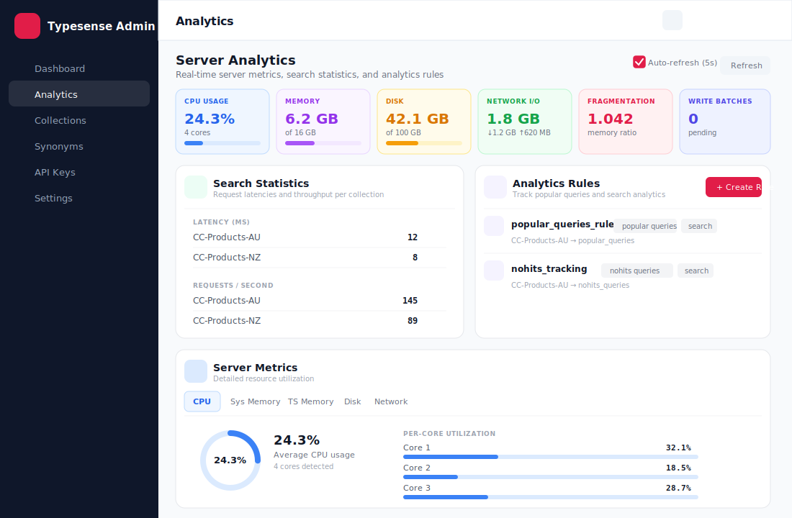
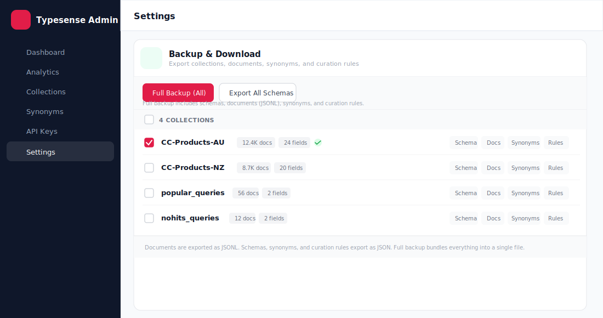

# Typesense Admin UI

A modern, full-featured admin dashboard for [Typesense](https://typesense.org/) — built with **Next.js 16**, **TypeScript**, and **Tailwind CSS**. Manage collections, documents, synonyms, curation rules, analytics, and API keys through an intuitive web interface.

> **Zero config required** — no server-side environment variables. Connect to any Typesense server directly from your browser.

---

## Screenshots

### Dashboard


### Analytics — Server Metrics & Search Stats


### Document Search with Faceted Filtering


### Schema Editor


### Curation Rule Editor — 3-Panel Layout


### Settings with Backup & Download


### Backup & Download Manager


### Login Page


---

## Features

| Feature | Description |
|---|---|
| **Dashboard** | Server health, collection stats, quick actions |
| **Analytics** | Real-time CPU, memory, disk, network metrics with tabbed detail views; per-collection search latency and throughput; analytics rule management |
| **Collections** | Create, browse, delete collections with full schema control |
| **Document Search** | Full-text search with faceted filtering, range sliders, list/grid views |
| **Inline Editing** | Edit document JSON directly, delete with double-click confirmation |
| **Schema Editor** | Add, edit, drop fields with property toggles (facet, sort, index, infix, stem, etc.) |
| **Synonyms** | One-way and multi-way synonym sets, bulk CSV/JSON upload |
| **Curation Rules** | 3-panel rule editor with live preview — pin/hide items, filters, sort, replace query, metadata |
| **API Keys** | Create scoped keys with collection/action permissions, copy/reveal/delete |
| **Backup & Download** | Full backup (schemas + documents + synonyms + rules) as single file, per-collection export (schema JSON, documents JSONL, synonyms, curation rules), multi-select |
| **Config Export/Import** | Export connection config as JSON from Settings, import on Login page |
| **Session Management** | Auto-logout on idle (1 hour), 30-day credential memory, secure cookie storage |
| **Responsive Design** | Mobile-first with collapsible sidebar, bottom-sheet modals, adaptive grids |

---

## Analytics

The analytics page (`/analytics`) provides real-time server monitoring and search analytics:

### System Overview
Six overview cards at the top showing CPU usage, system memory, disk, network I/O, fragmentation ratio, and pending write batches — each with progress bars and color-coded severity.

### Server Metrics (Tabbed)
Five dedicated tabs for detailed resource views:
- **CPU** — Circular progress ring with average usage + per-core bar gauges (color-coded by load)
- **System Memory** — Ring gauge for used/total + usage bar + summary cards
- **Typesense Memory** — Active/allocated/resident/mapped/metadata/retained breakdown + fragmentation health card
- **Disk** — Ring gauge + stacked usage bar + free/used/total cards
- **Network** — Total I/O circle + received/sent bar gauges + summary cards

### Search Statistics
Per-collection search latency (ms) and requests per second, sorted by highest values.

### Analytics Rules
Create, view, and delete analytics rules (Typesense v30 format):
- **Popular Queries** — Track most-searched terms
- **No Results Queries** — Track searches with zero results
- **Counter** — Increment popularity fields from click/conversion events
- **Log** — Log events for analysis

Auto-creates destination collections when they don't exist.

---

## Backup & Download

The Settings page includes a full backup manager:

| Action | What it exports |
|---|---|
| **Full Backup** | Single JSON file with schemas, documents (JSONL), synonyms, and curation rules for all/selected collections |
| **Export All Schemas** | All collection schemas as a single JSON array |
| **Per-collection Schema** | Individual collection schema as JSON |
| **Per-collection Docs** | All documents as JSONL (one JSON object per line) |
| **Per-collection Synonyms** | Synonym definitions as JSON |
| **Per-collection Rules** | Curation/override rules as JSON |

Select specific collections with checkboxes, or export everything at once. Progress indicators show export status per collection.

---

## Tech Stack

| Technology | Purpose |
|---|---|
| [Next.js 16](https://nextjs.org/) | React framework (App Router) |
| [TypeScript 5](https://www.typescriptlang.org/) | Type safety |
| [React 19](https://react.dev/) | UI library |
| [Tailwind CSS 3.4](https://tailwindcss.com/) | Styling |
| [Typesense SDK 1.8.2](https://typesense.org/docs/) | Server-side Typesense client |
| [lucide-react](https://lucide.dev/) | Icons |
| [clsx](https://github.com/lukeed/clsx) + [tailwind-merge](https://github.com/dcastil/tailwind-merge) | Class utilities |

---

## Getting Started

### Prerequisites

- **Node.js** 18+ (recommended: 20+)
- **npm** 9+ (or yarn/pnpm)
- A running **Typesense** server (v0.25+ recommended, v30+ for analytics rules)

### Installation

```bash
git clone <repository-url>
cd typesense-admin-ui
npm install
```

### Running the App

```bash
# Development (with hot reload)
npm run dev

# Production build
npm run build
npm start

# Lint check
npm run lint
```

The app will be available at [http://localhost:3000](http://localhost:3000). On first visit you'll be redirected to the **Login** page to enter your Typesense connection details.

---

## API Routes

| Route | Methods | Description |
|---|---|---|
| `/api/health` | GET | Server health check |
| `/api/collections` | GET, POST | List / create collections |
| `/api/collections/[name]` | GET, DELETE | Get / delete a collection |
| `/api/collections/[name]/documents` | GET | Search documents |
| `/api/collections/[name]/export` | GET | Export all documents as JSONL |
| `/api/collections/[name]/synonyms` | GET, POST | List / create synonyms |
| `/api/collections/[name]/synonyms/[id]` | DELETE | Delete a synonym |
| `/api/collections/[name]/overrides` | GET, POST | List / create curation rules |
| `/api/collections/[name]/overrides/[id]` | DELETE | Delete a curation rule |
| `/api/keys` | GET, POST | List / create API keys |
| `/api/keys/[id]` | DELETE | Delete an API key |
| `/api/stats` | GET | Server stats (latency, RPS, write batches) |
| `/api/metrics` | GET | Server metrics (CPU, memory, disk, network) |
| `/api/analytics/rules` | GET, POST | List / create analytics rules (auto-creates destination collections) |
| `/api/analytics/rules/[name]` | GET, DELETE | Get / delete an analytics rule |

---

## Documentation

Detailed documentation is split into focused guides:

| Guide | Description |
|---|---|
| [Feature Guide](docs/FEATURES.md) | In-depth walkthrough of every feature with screenshots |
| [Deployment Guide](docs/DEPLOYMENT.md) | Vercel, Docker, Node.js, and nginx deployment instructions |
| [Security](docs/SECURITY.md) | How credentials are handled, security measures, production recommendations |
| [Project Structure](docs/STRUCTURE.md) | File organization, components, API routes, hooks, and utilities |

---

## Quick Links

- **Connecting:** Enter Protocol, Host, Port, and API Key on the login page — or import a JSON config file
- **Credentials:** Stored in browser cookie + localStorage only. Never sent to third parties.
- **Export config:** Settings page > Export Config button downloads a `.json` file
- **Import config:** Login page > "Import config file" link accepts the exported `.json`
- **Backup:** Settings page > Backup & Download section for full or per-collection exports
- **Analytics:** Analytics page for real-time server monitoring and search analytics rules

---

## License

MIT
