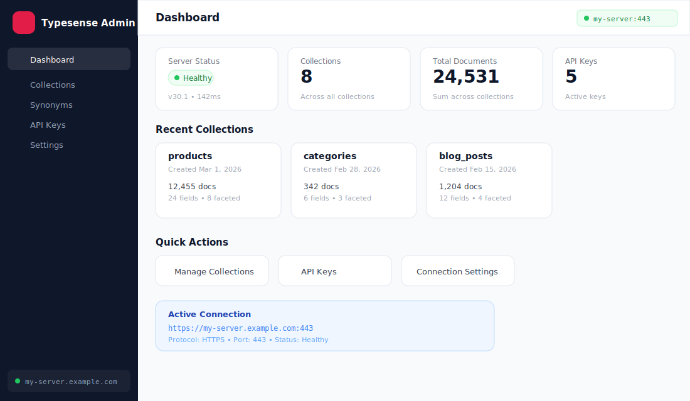
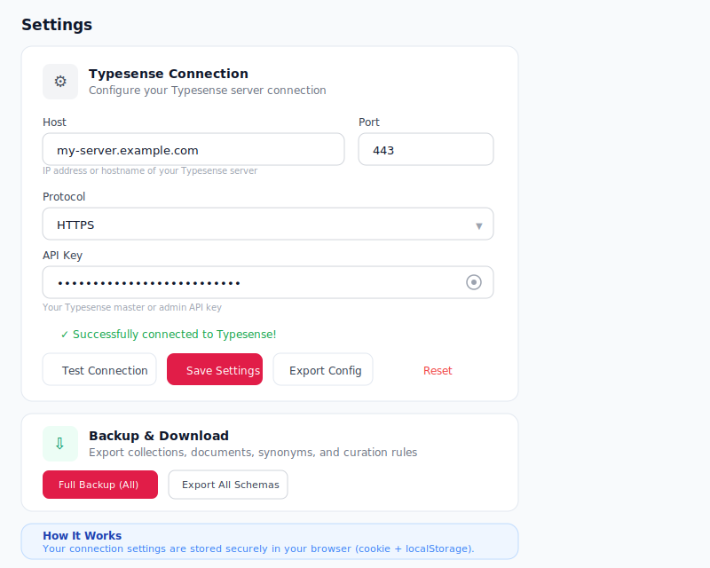
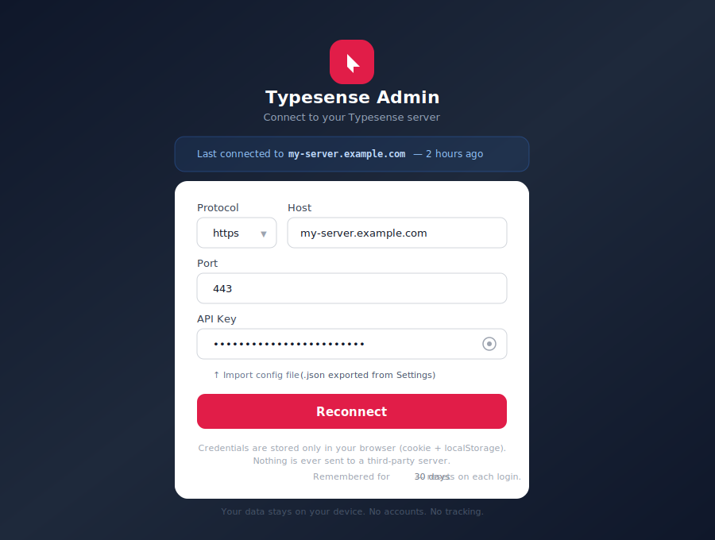

# Typesense Admin UI

A modern, full-featured admin dashboard for [Typesense](https://typesense.org/) — built with **Next.js 16**, **TypeScript**, and **Tailwind CSS**. Manage collections, documents, synonyms, curation rules, and API keys through an intuitive web interface.

> **Zero config required** — no server-side environment variables. Connect to any Typesense server directly from your browser.

---

## Screenshots

### Dashboard


### Document Search with Faceted Filtering


### Schema Editor


### Curation Rule Editor — 3-Panel Layout


### Settings with Config Export


### Login Page


---

## Features

| Feature | Description |
|---|---|
| **Dashboard** | Server health, collection stats, quick actions |
| **Collections** | Create, browse, delete collections with full schema control |
| **Document Search** | Full-text search with faceted filtering, range sliders, list/grid views |
| **Inline Editing** | Edit document JSON directly, delete with double-click confirmation |
| **Schema Editor** | Add, edit, drop fields with property toggles (facet, sort, index, infix, stem, etc.) |
| **Synonyms** | One-way and multi-way synonym sets, bulk CSV/JSON upload |
| **Curation Rules** | 3-panel rule editor with live preview — pin/hide items, filters, sort, replace query, metadata |
| **API Keys** | Create scoped keys with collection/action permissions, copy/reveal/delete |
| **Config Export/Import** | Export connection config as JSON from Settings, import on Login page |
| **Session Management** | Auto-logout on idle (1 hour), 30-day credential memory, secure cookie storage |
| **Responsive Design** | Mobile-first with collapsible sidebar, bottom-sheet modals, adaptive grids |

---

## Tech Stack

| Technology | Purpose |
|---|---|
| [Next.js 16](https://nextjs.org/) | React framework (App Router) |
| [TypeScript 5](https://www.typescriptlang.org/) | Type safety |
| [React 19](https://react.dev/) | UI library |
| [Tailwind CSS 3.4](https://tailwindcss.com/) | Styling |
| [Typesense SDK 1.8.2](https://typesense.org/docs/) | Server-side Typesense client |
| [lucide-react](https://lucide.dev/) | Icons |
| [clsx](https://github.com/lukeed/clsx) + [tailwind-merge](https://github.com/dcastil/tailwind-merge) | Class utilities |

---

## Getting Started

### Prerequisites

- **Node.js** 18+ (recommended: 20+)
- **npm** 9+ (or yarn/pnpm)
- A running **Typesense** server (v0.25+ recommended, v26+ for synonym sets)

### Installation

```bash
git clone <repository-url>
cd typesense-admin-ui
npm install
```

### Running the App

```bash
# Development (with hot reload)
npm run dev

# Production build
npm run build
npm start

# Lint check
npm run lint
```

The app will be available at [http://localhost:3000](http://localhost:3000). On first visit you'll be redirected to the **Login** page to enter your Typesense connection details.

---

## Documentation

Detailed documentation is split into focused guides:

| Guide | Description |
|---|---|
| [Feature Guide](docs/FEATURES.md) | In-depth walkthrough of every feature with screenshots |
| [Deployment Guide](docs/DEPLOYMENT.md) | Vercel, Docker, Node.js, and nginx deployment instructions |
| [Security](docs/SECURITY.md) | How credentials are handled, security measures, production recommendations |
| [Project Structure](docs/STRUCTURE.md) | File organization, components, API routes, hooks, and utilities |

---

## Quick Links

- **Connecting:** Enter Protocol, Host, Port, and API Key on the login page — or import a JSON config file
- **Credentials:** Stored in browser cookie + localStorage only. Never sent to third parties.
- **Export config:** Settings page > Export Config button downloads a `.json` file
- **Import config:** Login page > "Import config file" link accepts the exported `.json`

---

## License

MIT
