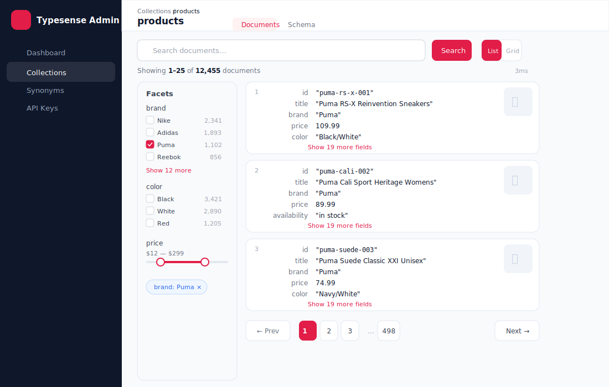
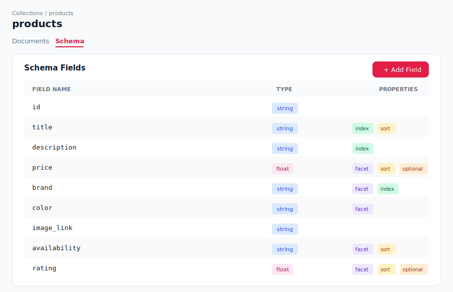
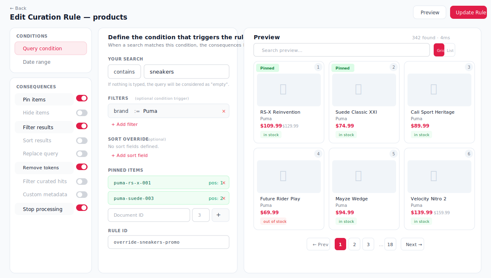

# Feature Guide

Complete walkthrough of every feature in Typesense Admin UI.

---

## Table of Contents

- [Dashboard](#dashboard)
- [Collections](#collections)
- [Documents](#documents)
- [Schema Editor](#schema-editor)
- [Synonyms](#synonyms)
- [Curation Rules (Search Overrides)](#curation-rules-search-overrides)
- [API Keys](#api-keys)
- [Settings](#settings)
- [Login & Connection](#login--connection)

---

## Dashboard

**Route:** `/`

The landing page provides an at-a-glance overview of your Typesense server:

- **Server Status** — Green/red indicator showing if the server is reachable
- **Collections Count** — Total number of collections
- **Total Documents** — Sum of documents across all collections
- **API Keys** — Number of configured API keys
- **Recent Collections** — Quick preview cards for up to 6 collections (click to navigate)
- **Quick Actions** — Links to Manage Collections, API Keys, and Connection Settings
- **Active Connection** — Displays the connected host, port, and protocol

---

## Collections

**Route:** `/collections`

Browse and manage all your Typesense collections:

- **Search** — Filter collections by name
- **Create Collection** — Opens a modal to define a new collection:
  - Set the collection name
  - Add fields with name, type, and options (facet, optional, sort, index, infix, stem, store, range_index)
  - Set default sorting field
- **Collection Cards** — Each card shows:
  - Collection name and creation date
  - Document count, field count, and faceted field count
  - Click to open collection detail
  - Delete button with confirmation modal

---

## Documents

**Route:** `/collections/[name]` (Documents tab)

Search, browse, edit, and delete documents within a collection.

### Document List View


*Algolia-style key-value layout with right-aligned field names, image thumbnails, and inline actions*

#### Searching
- Enter a search query and click **Search** (or press Enter)
- Use `*` (default) to browse all documents
- The search uses all indexed string fields automatically
- Search time is displayed in milliseconds

#### View Modes
- **List View** — Key-value layout with right-aligned field names. Shows up to 10 fields per document with a "Show more" link.
- **Grid View** — Card layout with image thumbnails. Auto-detects title, subtitle, and price fields from common naming patterns.

#### Image Detection
Documents are scanned for image URLs using a multi-pass strategy:
1. Fields with image-related names (e.g., `image`, `thumbnail`, `cover`, `photo`)
2. Top-level string values matching image URL patterns
3. Deep scan into nested objects/arrays (up to 3-4 levels)

#### Inline Editing
- Click the **pencil icon** on any document to open the JSON editor modal
- Edit the raw JSON and click **Update Document** to save (uses Typesense PATCH API)
- Invalid JSON is caught with an error message before saving

#### Deleting Documents
- Click the **trash icon** once to arm the delete
- Click again within 3 seconds to confirm deletion
- The document is removed from the list immediately on success

### Faceted Filtering


*Value facets with document counts, expandable lists, and field search*

The facet panel appears on the left sidebar (desktop) or as a toggleable panel (mobile):

- **Value Facets** — Checkboxes for each facet value with document counts. Shows 8 values initially with a "Show N more" link.
- **Range Sliders** — Numeric fields (int32, int64, float) display dual-handle range sliders. Drag handles to filter by range (uses `field:[min..max]` syntax).
- **Search Facets** — Type to filter the list of facet sections by field name
- **Active Filters** — Shown as chips above results. Value filters are blue; range filters are purple. Click X to remove.
- **Clear All** — Removes all active filters at once

### Pagination
- 25 documents per page
- Previous/Next buttons with numbered page navigation
- Smart page number display (up to 7 page buttons centered around current page)

---

## Schema Editor

**Route:** `/collections/[name]` (Schema tab)


*Field list with type badges and property indicators — facet, sort, optional, and more*

### Viewing Fields
Each field displays:
- Field name (monospace)
- Type badge (e.g., `string`, `int32`, `float[]`)
- Property badges showing active options (facet, sort, optional, index, infix, stem, store, range_index)

### Adding Fields
1. Click **Add Field**
2. Enter the field name
3. Select the field type:
   - `string`, `string[]`, `int32`, `int32[]`, `int64`, `int64[]`, `float`, `float[]`
   - `bool`, `bool[]`, `geopoint`, `geopoint[]`
   - `auto`, `object`, `object[]`, `image`, `string*`
4. Toggle desired options (facet, optional, sort, infix, index, stem, store, range_index)
5. Optionally set a locale
6. Click **Add Field** to submit

### Editing Fields
1. Click the **edit icon** on any field
2. Toggle property badges on/off
3. Modify the locale if needed
4. An "Unsaved changes" indicator appears when properties differ from saved state
5. Click **Save Changes** to apply (uses PATCH API with drop + re-add pattern)

### Dropping Fields
1. Click the **trash icon** on any field
2. Confirm in the modal — this permanently removes the field and its data

> **Note:** Typesense requires dropping and re-adding a field to change its properties. The UI handles this automatically in a single PATCH request.

---

## Synonyms

**Route:** `/collections/[name]/synonyms` or `/synonyms`

Manage synonym sets for improving search relevance.

### Synonym Types
- **Multi-way** — All terms are interchangeable (e.g., "blazer", "jacket", "coat")
- **One-way** — A root term maps to synonyms (e.g., "pants" -> "trousers", "slacks")

### Creating Synonym Sets
1. Click **New Synonym Set**
2. Enter a set name
3. Add items:
   - For **multi-way**: enter comma-separated synonyms
   - For **one-way**: enter a root term and comma-separated synonyms
4. Add multiple items to a single set
5. Click **Create** to save

### Bulk Upload
1. Click **Bulk Upload**
2. Paste synonym data in CSV or JSON format
3. The modal provides format instructions and examples
4. Click **Upload** to create multiple sets at once

### Managing Sets
- **Expand** a set to see all its synonym items with type badges and term details
- **Edit** a set to modify its items
- **Delete** a set with confirmation modal

---

## Curation Rules (Search Overrides)

**Route:** `/collections/[name]/rules`

Create rules to curate search results for specific queries. The editor uses a **3-panel layout** inspired by Algolia's rule builder.

### 3-Panel Editor


*Left: conditions & consequences sidebar. Center: form panel. Right: live preview*

#### Left Panel — Sidebar
The sidebar organizes all rule sections into **Conditions** and **Consequences**:

**Conditions** (always visible):
- Query condition — match type (exact/contains) and search query
- Date range — optional effective_from and effective_to timestamps

**Consequences** (toggle on/off with switches):
- Pin items — pin documents to specific positions
- Hide items — exclude documents from results
- Filter results — apply a `filter_by` expression
- Sort results — custom `sort_by` order
- Replace query — substitute the matched query
- Remove matched tokens — control token removal behavior
- Filter curated hits — apply filters to curated results
- Custom metadata — attach JSON metadata to the rule
- Stop processing — prevent subsequent rules from firing

#### Center Panel — Form

Each sidebar item opens its corresponding form section:
- **Query condition** — match type selector + query input + optional rule filter_by + rule ID
- **Pin items** — add document IDs with position numbers
- **Hide items** — add document IDs to exclude
- **Filter builder** — visual row builder for `filter_by` expressions (field, operator, value)
- **Sort builder** — visual row builder for `sort_by` expressions (field, direction)
- **Replace query** — text input for query substitution
- **Toggle controls** — for remove_matched_tokens, filter_curated_hits, stop_processing
- **Metadata editor** — JSON textarea for custom metadata

#### Right Panel — Live Preview

The preview panel shows how search results will look with the rule applied:

- **Auto-preview** — results update automatically (500ms debounce) as you edit the rule
- **Search bar** — test ad-hoc queries against the rule's filters/sort
- **Grid/List toggle** — switch between product card grid and compact list view
- **Pinned badges** — pinned items show a green "Pinned" badge
- **Excluded items** — hidden documents are filtered out of preview
- **Pagination** — navigate through preview pages (20 items per page)
- **Manual refresh** — "Preview" button in the top toolbar for on-demand refresh

### Managing Rules
- View all rules in a table showing query, match type, and active consequences
- **Edit** any rule — opens the 3-panel editor pre-filled with the rule's configuration
- **Delete** rules with confirmation

---

## API Keys

**Route:** `/keys`

Manage Typesense API keys with scoped permissions.

### Creating a Key
1. Click **New API Key**
2. Fill in:
   - **Description** — Human-readable label
   - **Actions** — Select permissions (e.g., `documents:search`, `documents:get`, `collections:*`)
   - **Collections** — Scope to specific collections or `*` for all
   - **Expires** — Optional expiration date/time
3. Click **Create**
4. The generated key value is displayed — **copy it immediately** as it won't be shown in full again

### Managing Keys
- **View** all keys in a table with ID, description, masked value, actions, collections, and expiry
- **Reveal/Hide** key values with the eye icon (masked by default: `abcd••••••wxyz`)
- **Copy** any key value to clipboard
- **Delete** keys with confirmation modal

---

## Settings

**Route:** `/settings`

Configure and manage the Typesense connection:

- **Host** — Server hostname or IP address
- **Port** — Server port number
- **Protocol** — HTTP or HTTPS
- **API Key** — Admin API key (hidden by default, toggle visibility)
- **Test Connection** — Verify the connection before saving
- **Save Settings** — Store in browser cookie + localStorage
- **Export Config** — Download connection settings as a `.json` file (host, port, protocol, apiKey)
- **Reset** — Clear all stored credentials from this browser

### Config Export/Import

Export your connection configuration from the Settings page as a JSON file:

```json
{
  "host": "my-typesense.example.com",
  "port": 443,
  "protocol": "https",
  "apiKey": "your-api-key-here"
}
```

Import the same file on the **Login** page using the "Import config file" link — it pre-fills the form fields so you can connect with one click.

---

## Login & Connection

**Route:** `/login`

### Connecting
1. Navigate to `/login` (auto-redirected if not connected)
2. Enter your Typesense server's **Protocol**, **Host**, **Port**, and **API Key**
3. Or click **Import config file** to load a previously exported `.json` config
4. Click **Connect** to verify and save credentials

### Credential Storage
Credentials are stored entirely in your browser — the server is stateless:

| Storage | Purpose | Lifetime |
|---|---|---|
| Browser Cookie (`typesense_connection`) | Active session — sent to API proxy routes | 1 year |
| localStorage | "Remember me" — pre-fills login form on return | 30-day sliding window |

### Session Management
- Auto-logout after **1 hour of inactivity** (idle timer)
- Manual logout from the sidebar
- "Forget credentials" button on login page clears saved config
- "Reset" button on settings page clears all stored data

### Returning Users
When saved credentials exist, the login page:
- Pre-fills all form fields from localStorage
- Shows a banner: "Last connected to **host** — X ago"
- Changes the button to "Reconnect"
- Offers a trash icon to forget saved credentials
